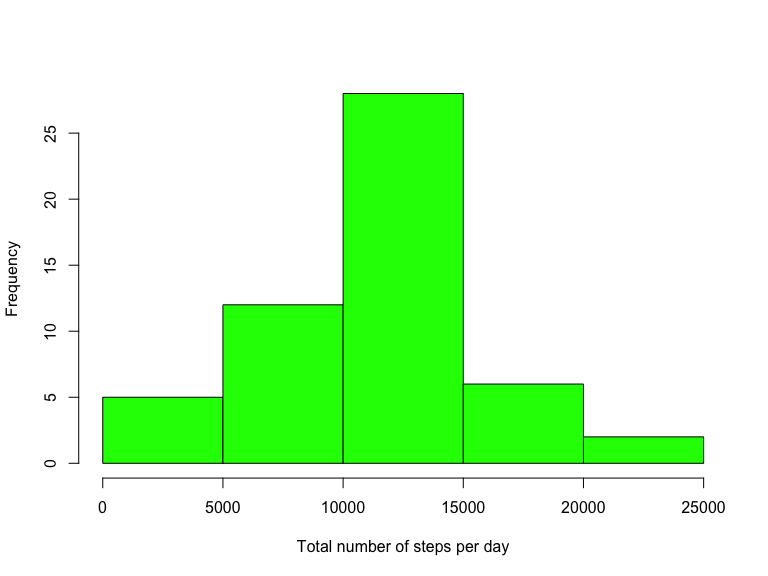
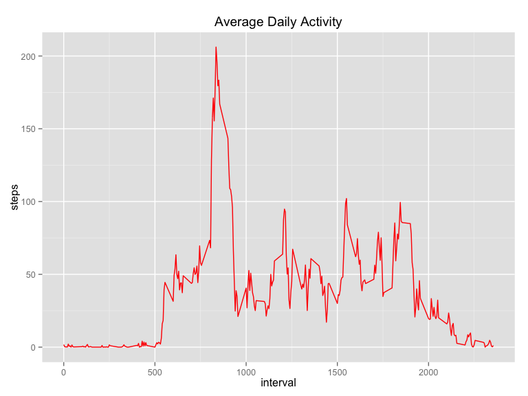
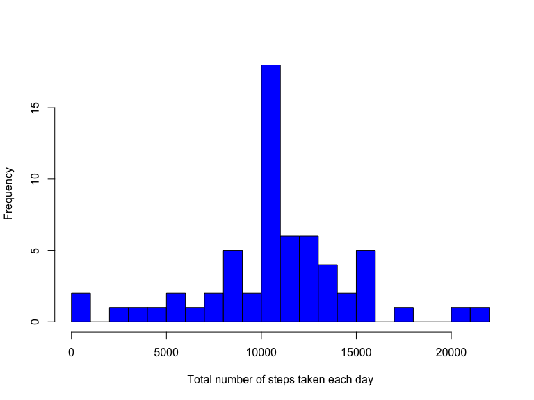
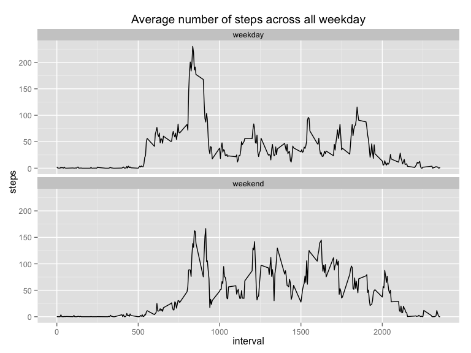

# Reproducible Research: Peer Assessment 1
## Title: "Reproducible Research: Peer Assessment 1"
### Author: Milen Angelov
### Date: 16 July, 2015

## Introduction
This assignment makes use of data from a personal activity monitoring device. This device collects data at 5 minute intervals through out the day. The data consists of two months of data from an anonymous individual collected during the months of October and November, 2012 and include the number of steps taken in 5 minute intervals each day.

## Loading and preprocessing the data
Let first load the data from the given file. It is zipped. So first check if it is already unzipped *(file exists)* and the read it using **read.csv** function. 


```r
# Define global option for knitr
knitr::opts_chunk$set(fig.width=8, fig.height=6, fig.path='figure/',
                      echo=TRUE, warning=FALSE, message=FALSE)
```


```r
# check if the file was already unzipped
fName <- "activity.csv";

if(!file.exists(fName)){
    unzip("activity.zip", fName);
}

# read the data and store it in activity dataframe
rawData <- read.csv("activity.csv", sep = ",", na.strings = "NA");
```
   
Now that we have our data let's take a look at it. For this part we can ignore missing data.

```r
str(rawData);
```

```
## 'data.frame':	17568 obs. of  3 variables:
##  $ steps   : int  NA NA NA NA NA NA NA NA NA NA ...
##  $ date    : Factor w/ 61 levels "2012-10-01","2012-10-02",..: 1 1 1 1 1 1 1 1 1 1 ...
##  $ interval: int  0 5 10 15 20 25 30 35 40 45 ...
```

See first 10 rows of the data in table format.

```r
head(rawData, 10);
```

```
##    steps       date interval
## 1     NA 2012-10-01        0
## 2     NA 2012-10-01        5
## 3     NA 2012-10-01       10
## 4     NA 2012-10-01       15
## 5     NA 2012-10-01       20
## 6     NA 2012-10-01       25
## 7     NA 2012-10-01       30
## 8     NA 2012-10-01       35
## 9     NA 2012-10-01       40
## 10    NA 2012-10-01       45
```
  
Before we continue we process the data into a format suitable for analysis

```r
activity <- rawData[complete.cases(rawData), ];
```


## What is mean total number of steps taken per day?
First let's find out total number of steps taken per day. I will use **dplyr** library:

```r
library(dplyr);
totalSteps <- aggregate(steps ~ date, data = activity, sum);
```
 
Second make a histogram of the total number of steps taken each day


```r
hist(totalSteps$steps, 
     xlab="Total number of steps per day",
     main = NULL, #do not print any title
     col="green")
```

 


Now let's calculate the mean. For that part we will ignore missing data:

```r
meanSteps <- mean(totalSteps$steps);
print(meanSteps);
```

```
## [1] 10766.19
```

Calculate the median of the total number of steps taken per day and print it

```r
medianSteps <- median(totalSteps$steps);
print(medianSteps);
```

```
## [1] 10765
```

## What is the average daily activity pattern?
1. Make a time series plot (i.e. type = "l") of the 5-minute interval (x-axis) and the average number of steps taken, averaged across all days (y-axis)

```r
library(ggplot2);

aggregator <- function( param ) {
    mean( param, na.rm = TRUE ); # remove NA values
}

stepsByInterval <- aggregate(steps ~ interval, data = activity, FUN = aggregator);

ggplot(stepsByInterval, aes(interval, steps)) + 
    geom_line(colour = "red") + 
    labs(title = expression("Average Daily Activity") )
```

 

Now calculate and print which 5-minute interval, on average across all the days in the dataset, contains the maximum number of steps

```r
# Calculate the peak interval
maxStepsByInterval <- stepsByInterval$interval[which.max(stepsByInterval$steps)];
print(paste("Maximum interval is: ", maxStepsByInterval));
```

```
## [1] "Maximum interval is:  835"
```

```r
# Calculate the maximum
maxSteps <- max(stepsByInterval$steps);
print(paste("Maximum of steps is: ", round(maxSteps)));
```

```
## [1] "Maximum of steps is:  206"
```

## Imputing missing values
1. Calculate and report the total number of missing values in the dataset

```r
# let see first which are the missing values
missingValues <- is.na(rawData);
# and calculate the total number of them
missingValuesTotal <- sum(missingValues)
print(paste("Total number of missing values is: ", missingValuesTotal));
```

```
## [1] "Total number of missing values is:  2304"
```

2. Devise a strategy for filling in all of the missing values in the dataset. 

3. Create a new dataset that is equal to the original dataset but with the missing data filled in.

```r
# create a copy of the raw data
activityBeta <- rawData;

# replace with the mean for that 5-minute interval
for (i in 1:nrow(activityBeta)) {
    if (is.na(activityBeta[i, 1])) {
        #if it is NA reaplce it with the mean calculated before
        thatInterval <- as.numeric(activityBeta[i, 3]);
        dfOfInterval <- subset(stepsByInterval, stepsByInterval$interval == thatInterval);
        activityBeta[i, 1] <- dfOfInterval$steps;
    }
}

# check if the new dataset is equal to the original one by comparing the number of rows
if(dim(activityBeta)[1] == dim(rawData)[1])
    print("Both datasets are equal");
```

```
## [1] "Both datasets are equal"
```
4. Make a histogram of the total number of steps taken each day and Calculate and report the mean and median total number of steps taken per day.

```r
stepsPerDayTotal <- aggregate(steps ~ date, data = activityBeta, sum);

# change the name of the steps column
names(stepsPerDayTotal)[2] <- "steps.summary"

hist(stepsPerDayTotal$steps,
     main = NULL,
     xlab = "Total number of steps taken each day", 
     col="blue",
     breaks = 30);
```

 

```r
# Print calculation of the mean and median total number of steps taken per day 
print(mean(stepsPerDayTotal$steps.summary));
```

```
## [1] 10766.19
```

```r
print(median(stepsPerDayTotal$steps.summary));
```

```
## [1] 10766.19
```

## Are there differences in activity patterns between weekdays and weekends?
1. Create a new factor variable in the dataset with two levels ??? weekday and weekend indicating whether a given date is a weekday or weekend day.

```r
# first set all day of the weeks to be weekday
activityBeta$dow <- "weekday";
# now create logical vector for interception
weekendVector <- weekdays(as.Date(activityBeta$date)) %in% c("Saturday", "Sunday");
# change value of dow with interception 
activityBeta$dow[weekendVector == TRUE] <- "weekend";

activityBeta$dow <- as.factor(activityBeta$dow);
```

Let's see how activityBeta looks like

```r
print(activityBeta[sample(nrow(activityBeta), 10), ]);
```

```
##       steps       date interval     dow
## 16355    36 2012-11-26     1850 weekday
## 6456      0 2012-10-23      955 weekday
## 1671      0 2012-10-06     1910 weekend
## 17137     0 2012-11-29     1200 weekday
## 5313    160 2012-10-19     1040 weekday
## 10665     0 2012-11-07       40 weekday
## 4216      0 2012-10-15     1515 weekday
## 11852     0 2012-11-11      335 weekend
## 7467      0 2012-10-26     2210 weekday
## 5977      0 2012-10-21     1800 weekend
```

2. Make a panel plot containing a time series plot (i.e. type = "l") of the 5-minute interval (x-axis) and the average number of steps taken, averaged across all weekday days or weekend days (y-axis).

```r
# First calculate average number of steps taken, averaged across all 
# weekday days or weekend days
avgStepPerWeekday <- aggregate(activityBeta$steps,
                               list(interval = activityBeta$interval, 
                                   dow = activityBeta$dow), 
                               mean);
# Becuase objects are missing in new data.frame
names(avgStepPerWeekday) <- c("interval", "dow", "steps");

# make the plot
ggplot(avgStepPerWeekday, aes(interval, steps)) + 
    geom_line(colour = "black") + 
    labs(title = expression("Average number of steps across all weekday") ) +
    facet_wrap(~dow, ncol = 1)
```

 

##### end of file
